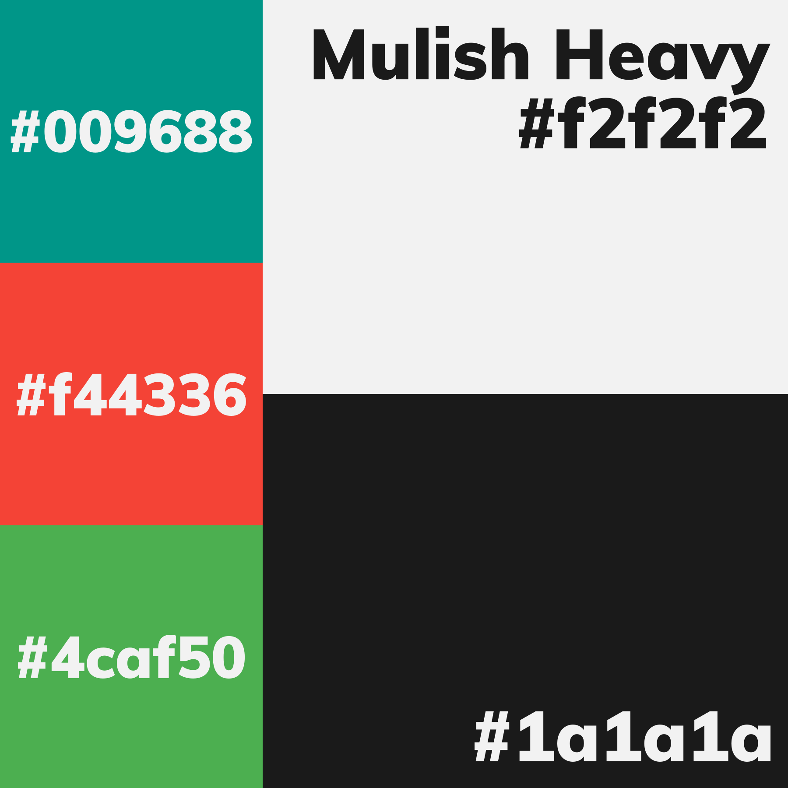
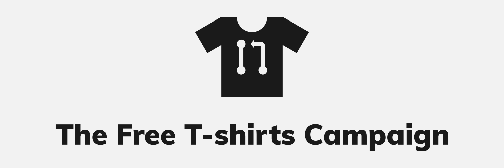

# Media

Welcome to the media house of The Free T-shirts Campaign!

This folder contains all the designs of the campaign, as well as documents and
guides catered to designers who are interested in working with us!

## Table of Content

1. [Conventions](#conventions)
	1. [Colors and typography](#colors-and-typography)
	2. [File format](#file-format)
	3. [Filename](#filename)
2. [Identity](#identity)

## Conventions

### Colors and typography

The picture below shows the colors and fonts selected for The Free T-shirts
Campaign's designs.

### File format

Because The Free T-shirts Campaign :heart: free software, **SVG** (Scalable
Vector Graphics) is selected as the preferred file format for vector designs
here.

**SVG files must be plain SVG** (e.g. contains no software-specific tags or
attributes). If your vector graphics editor saves files in a custom format,
please export to plain SVG.

### Filename

Filenames of files in this folder must be in lowercase. Plain SVG files must end
with `.plain.svg`.

## Identity

The Free T-shirts Campaign has 3 graphical items for identification:
1. The logo
2. The wordmark
3. The logo system

<table>
	<thead>
		<tr align="center">
			<td><b>Logo</b></td>
			<td><b>Wordmark</b></td>
			<td><b>Logo system</b></td>
		</tr>
	</thead>
	<tbody>
		<tr align="center">
			<td>
				
			</td>
			<td>
				
			</td>
			<td>
				
			</td>
		</tr>
	</tbody>
</table>
